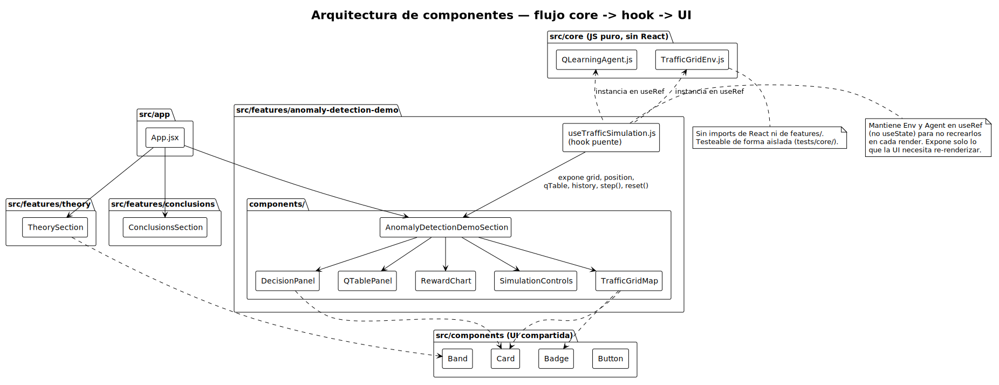
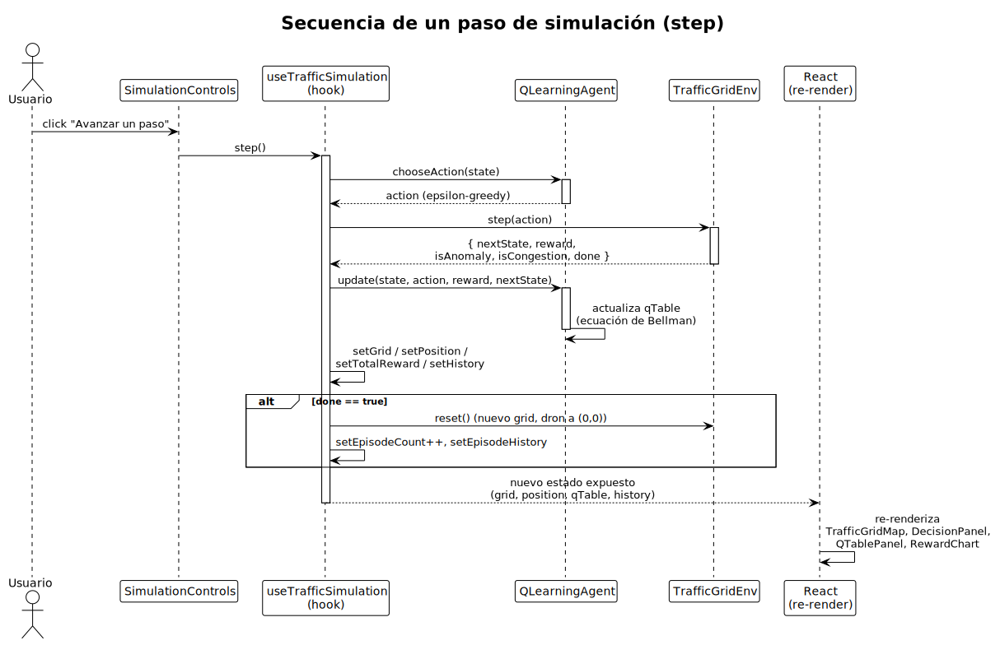

# Aprendizaje por Refuerzo para Detección de Anomalías en Tráfico Vehicular

**Estudiante:** Angelo Huaiquil

Aplicación web educativa e interactiva que enseña Aprendizaje por Refuerzo (RL) mediante un caso
práctico de navegación autónoma: un dron de monitoreo que aprende, con Q-learning tabular, a
recorrer una ciudad para encontrar accidentes o cortes de ruta lo más rápido posible, evadiendo la
congestión que va descubriendo en el camino. Proyecto individual para el curso "Sistemas
Inteligentes".

## Stack

- React + Vite, sin backend.
- Deploy estático en GitHub Pages.
- Sin router: una sola página con secciones ancladas por scroll (Teoría, Algoritmo, Demo en
  vivo, Conclusiones).
- Tests: Vitest + React Testing Library + `jest-axe` + `fast-check`.

## Instalación y uso

```bash
npm install
npm run dev       
```

## Arquitectura

El código se organiza **por feature** ("screaming architecture") en vez de por tipo técnico —
cada sección pedagógica de la página es una carpeta autocontenida. La lógica de Aprendizaje por
Refuerzo vive separada en `core/`, sin ninguna dependencia de React, para poder testearla de forma
aislada.

```
src/
├── app/                        # Shell: layout general, navegación entre secciones
│   └── App.jsx
├── features/                   # Cada sección pedagógica = un dominio autocontenido
│   ├── theory/                 # Intro a RL + conceptos fundamentales + algoritmo
│   ├── anomaly-detection-demo/ # Caso práctico: entorno + agente + resultados en vivo
│   │   ├── components/
│   │   └── hooks/
│   └── conclusions/            # Conclusiones y limitaciones
├── core/                       # Lógica de RL PURA — sin imports de React, testeable aislada
│   ├── environment/
│   │   └── TrafficGridEnv.js   # MDP: reset(), step(action) → {reward, nextState, done, ...}
│   └── agent/
│       └── QLearningAgent.js   # tabla Q, política epsilon-greedy, update(s,a,r,s')
├── components/                 # UI compartida entre features (Card, Badge, Band, Button)
├── assets/                     # Imágenes y diagramas del contenido pedagógico
├── styles/                     # Tokens de diseño y estilos globales
├── test/                       # Setup global de Vitest (jsdom, matchers)
└── main.jsx
tests/                          # Carpeta espejo de src/, alias @ configurado en vite.config.js
docs/
├── informe.md                  # Informe breve (2-4 páginas) del entregable
└── diagrams/                   # Diagramas PlantUML (.puml) + su render SVG
```

### Diagrama de componentes

Flujo desde la lógica de RL pura (`core/`) hasta la UI, pasando por el hook puente
`useTrafficSimulation`:



Fuente editable: [`docs/diagrams/arquitectura-componentes.puml`](docs/diagrams/arquitectura-componentes.puml).

### Diagrama de secuencia: un paso de simulación

Qué ocurre cuando el usuario dispara `step()` desde los controles de la demo, hasta el
re-render de React con el nuevo estado del agente:



Fuente editable: [`docs/diagrams/secuencia-step-simulacion.puml`](docs/diagrams/secuencia-step-simulacion.puml).

## Documentación adicional

- [`docs/informe.md`](docs/informe.md) — informe breve (2-4 páginas) exigido como entregable:
  introducción a RL, conceptos fundamentales, algoritmo, modelado del caso práctico, visualización
  y conclusiones/limitaciones.
